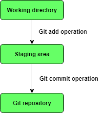
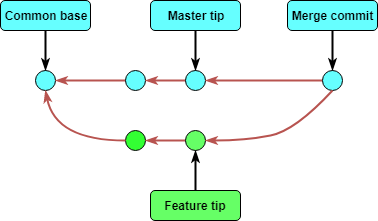
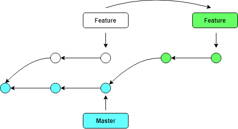

# Git-Concepts
All about Git. Git concepts. Cit commands...


#### 1. Basic Concepts
* **Local repository** is a private workplace as *working copy* for developer to make changes. And after commit, these changes become part of remote repository (permanent stored on server).

* **Working directory and Staging area or Index**
<p align="center"></p>

* **Blob** stands for Binary Large Object. Each version of a file is reprensted by blob. Blob holds the file data but does not contain any metadata about the file. It is a binary file, and in Git databases, it is named as the SHA1 hash of that file. In Git, files are not addressed by names. Everything is content-addressed.

* **Tree** is an object, which represents a directory. It holds blobs as well as sub-directories. A tree is a binary file which stores references to to blobs and sub-trees.

* **Commit** holds the current state of the repository. Commit also is named by the SHA1 hash. A commit object is a node in linked list. Each commit has a pointer points to the parent commit so that we can view the history of the repository. If a commit has multiple parent commit, then that commit has been created by merging two branches.

* **Branch** is a line of development. By default, Git has the master branch. Usually, branch is used to develop a new feature. Once the feature is done, the branch is merged back to the master branch. Every branch is referenced by HEAD, which point to the latest commit in branch.

* **Tag** assigns a meaningful name with a specific version in the repository. Usually, developers create tags for product releases.

* **Clone** get remote repository into the local one.

* **Pull** operation will copy changes from remote repository instance to the local one. The pull operation is used to synchronize between two repository instances.

* **Push** operation will copy changes from local repository instance to a remote one. The push operation will store changes permanently on remote repository.

* **HEAD** is a pointer that point to the latest commit in a branch. Whenever we make a commit HEAD will be updated. The heads of the branches are stored in .git/refs/heads/ directory.
    ```
    [ubuntu]$ ls .git/refs/heads/
    master
    develop
    feature
    
    [ubuntu]$ cat .git/refs/heads/master
    570837e7d58fa4bccd86cb575d884502188b0c49
    ```


* **Revision** represents the version of the source code. Revision is represented by commit. Commit is identified by SHA1 hash.


#### 2. Merging vs. Rebasing
* **Merging**<br/><br/>
* **Rebasing**<br/><br/>
* **When to merge and When to rebase**
    * What is more valuable for you? The clean, linear history or the ability to trace your branches?
    * Rebase for first case and merge for the second one.
