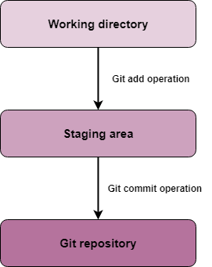

# Git-Concepts
All about Git. Git concepts. Cit commands...

#### 1. Basic Concepts
* **Local repository** is a private workplace as *working copy* for developer to make changes. And after commit, these changes become part of remote repository (permanent stored on server).

* **Working directory and Staging area or Index**

* **Blob**
* **Tree**
* **Commit**
* **Branch**
* **Tag**
* **Clone**
* **Pull**
* **Push**
* **HEAD**
* **Revision**
* **URL**

#### 2. Workflow

#### 3. Create Remote Repository

#### 4. Clone
